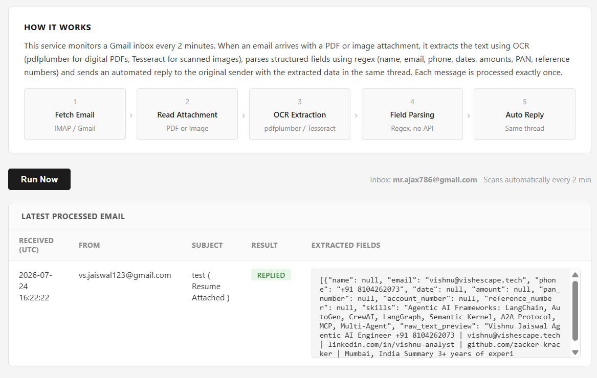

# Email Attachment Extractor

An automated pipeline that monitors a Gmail inbox, reads PDF and image attachments, extracts structured data using OCR and regex, and replies to the sender in the same email thread. No LLM or external AI API required.

**Live demo:** https://hdfc-email-extractor.onrender.com  
**Documentation:** [docs/Email_Attachment_Extractor_Documentation.pdf](docs/Email_Attachment_Extractor_Documentation.pdf)

---

## Dashboard



---

## How it works

1. **Fetch** — connects to Gmail via IMAP and checks for emails received in the last 3 days (up to 5 per scan)
2. **Read Attachment** — identifies PDF and image files (PNG, JPG, TIFF, BMP)
3. **OCR Extraction** — uses `pdfplumber` for digital PDFs with a text layer; falls back to `Tesseract` OCR for scanned or image-based files
4. **Field Parsing** — extracts common fields using regex: name, email, phone, date, amount, PAN number, account number, reference number, skills
5. **Auto Reply** — sends the extracted data back to the original sender in the same thread using `In-Reply-To` and `References` headers

Each message is processed exactly once (idempotency via SQLite).

---

## Project structure

```
.
├── app.py                   # Flask web server + APScheduler background job
├── email_data_extractor.py  # Core 5-stage pipeline
├── requirements.txt         # Python dependencies
├── Procfile                 # gunicorn start command
├── render.yaml              # Render deployment blueprint
├── railway.json             # Railway deployment config
├── nixpacks.toml            # System packages for Railway (tesseract + poppler)
├── .env.example             # Environment variable template (no values)
├── .gitignore               # Excludes .env and the SQLite database
└── docs/
    ├── dashboard.png                              # Dashboard screenshot
    └── Email_Attachment_Extractor_Documentation.pdf
```

---

## Environment variables

Copy `.env.example` to `.env` and fill in your values. Never commit `.env`.

| Variable | Description |
|---|---|
| `IMAP_HOST` | IMAP server (default: `imap.gmail.com`) |
| `SMTP_HOST` | SMTP server (default: `smtp.gmail.com`) |
| `EMAIL_USER` | Gmail address to monitor |
| `EMAIL_PASS` | Gmail App Password (16 characters, from Google Account > Security > App Passwords) |

> **Gmail setup:** Enable 2-Step Verification, then generate an App Password at `myaccount.google.com/apppasswords`. Also enable IMAP under Gmail Settings > Forwarding and POP/IMAP.

---

## Local setup

```bash
pip install -r requirements.txt
cp .env.example .env   # fill in your values
python app.py          # http://localhost:5000
```

---

## Deploy to Render

1. Push this repo to GitHub
2. Go to [dashboard.render.com](https://dashboard.render.com) → New → Blueprint → select the repo
3. Add environment variables under the Environment tab
4. Render reads `render.yaml` automatically and deploys

Render does not block outbound SMTP (port 587), so replies are delivered without extra configuration.

---

## Extracted fields

| Field | Description |
|---|---|
| `name` | Labeled name field |
| `email` | Email address |
| `phone` | Phone number (Indian or international) |
| `date` | Common date formats |
| `amount` | Currency values (Rs., INR, USD, $) |
| `pan_number` | Indian PAN format |
| `account_number` | Labeled account number |
| `reference_number` | Labeled reference number |
| `skills` | Skills section (useful for resumes) |
| `raw_text_preview` | First 300 characters of extracted text |

---

## Security notes

- Credentials are loaded exclusively from environment variables
- `.env` and the SQLite database are excluded from version control
- Each email is marked processed after reply — no duplicate replies on re-run
